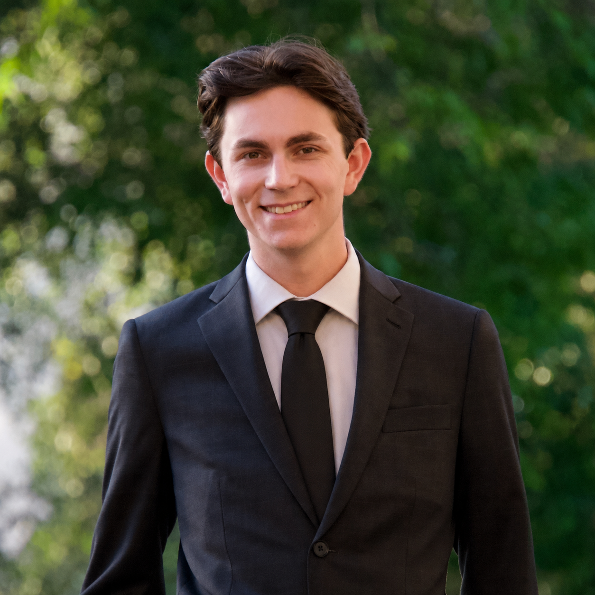

:::::::: home-hero
::::::: home-hero__inner
::::: home-hero__content
::: eyebrow
Applied Statistics \| AI \| Consulting
:::

# Hi, I'm [Jett]{.hero-name}.

Explore my work at the intersection of statistics, AI, and organizational problem-solving.

::: button-row
[Learn more about me](profile.qmd){.btn .btn-primary} [Explore my work](work.qmd){.btn .btn-primary}
:::
:::::

::: home-hero__media

:::
:::::::
::::::::

:::::::::: section-block
## Featured Work

::::::::: {.card-grid .cards-3}
:::: work-card
::: card-kicker
Research
:::

### [Designed For Impact](work/thesis/designed-for-impact.qmd)

A framework that helps early-career statisticians and data scientists maximize and communicate the impact of their consulting engagements.
::::

:::: work-card
::: card-kicker
Coding Projects
:::

### [LIFT](work/builds/lift.qmd)

An AI-powered operations tool to help a fictitious nonprofit streamline operations, improve service reports, and make more informed resource allocation decisions.
::::

:::: work-card
::: card-kicker
Community Engagement
:::

### [Nonprofit M&A](work/leadership/maritime-integration.qmd)

My work on the organizational restructuring for a historic, eight-figure strategic initiative in the California higher education system.
::::
:::::::::
::::::::::

:::::: section-band
::::: {.section-block .focus-grid}
::: focus-copy
## Current Focus

Later this year, I will defend my master's thesis entitled, *Designed For Impact: The Statistical Collaborator's Workflow*. These are the tasks I'm currently working on.
:::

::: focus-list
- Analyzing results from our framework validation research.
- Writing a full-length thesis to defend this fall.
- Authoring a peer-reviewed paper to accompany the thesis.
- Preparing a contributed talk for the 2026 Joint Statistical Meetings.
:::
:::::
::::::
